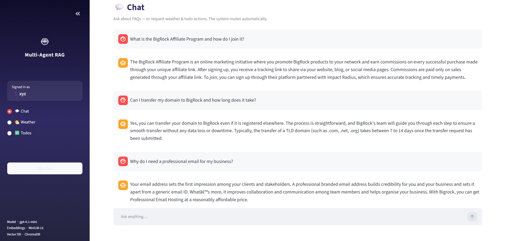
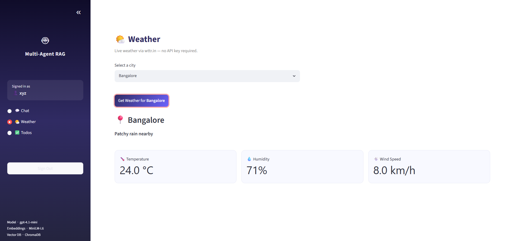
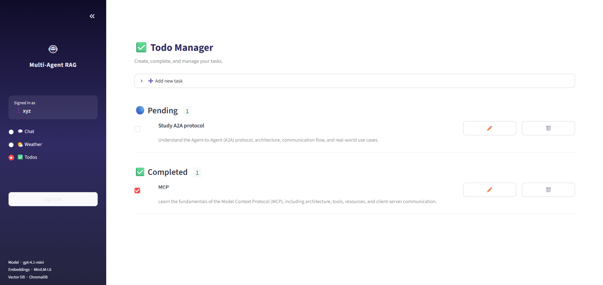

# Multi-Agent RAG System

A production-grade multi-agent AI system built with **FastAPI**, **LangGraph**, and **ChromaDB**.  
It answers FAQ queries using RAG, provides live weather, and manages per-user tasks — all secured with JWT authentication.

---

## Quick Start

### 1. Prerequisites

- Python 3.11+
- OpenAI API key (`gpt-4.1-mini` access)

### 2. Clone and set up

```bash
git clone <your-repo-url>
cd multi-agent-rag

python -m venv .venv
source .venv/bin/activate        # Windows: .venv\Scripts\activate
pip install -r requirements.txt
```

### 3. Configure environment

```bash
cp .env.example .env
```

Open `.env` and fill in:

```env
OPENAI_API_KEY=sk-...
JWT_SECRET_KEY=any-long-random-string   # generate: python -c "import secrets; print(secrets.token_hex(32))"
```

Everything else has sensible defaults.

### 4. Run the API server

```bash
uvicorn app.main:app --reload
```

- API: `http://localhost:8000`
- Swagger docs: `http://localhost:8000/docs`

> On first startup, the server automatically ingests `data/faqs.xlsx` into ChromaDB (386 FAQ vectors). Subsequent restarts skip ingestion.

### 5. Run the Streamlit UI

```bash
streamlit run streamlit_app.py
```

- UI: `http://localhost:8501`

### 6. Run with Docker

```bash
cp .env.example .env   # fill in OPENAI_API_KEY and JWT_SECRET_KEY
docker-compose up --build
```

---

## Running Tests

```bash
pytest -v
```

Tests use an in-memory SQLite database and mock the ingestion pipeline — no API key needed.

---

## API Reference

### Authentication

```
POST /auth/register          Register a new user
POST /auth/token             Login → returns JWT token
```

All other endpoints require `Authorization: Bearer <token>`.

### Chat

```
POST /chat
Body: {"query": "What is the refund policy?"}

Response: {"answer": "...", "agent_used": "rag"}
```

Routes automatically to RAG agent (FAQ questions) or Tool agent (weather/todos).

### Weather

```
GET /weather?city=Mumbai
```

### Todos (per-user)

```
POST   /todos              Create a task
GET    /todos              List your tasks
GET    /todos/{id}         Get a task
PUT    /todos/{id}         Update a task
DELETE /todos/{id}         Delete a task
```

---

## Environment Variables

| Variable | Required | Default | Description |
|---|---|---|---|
| `OPENAI_API_KEY` | **Yes** | — | OpenAI API key |
| `JWT_SECRET_KEY` | **Yes** | — | Secret for signing JWT tokens |
| `OPENAI_CHAT_MODEL` | No | `gpt-4.1-mini` | LLM model |
| `JWT_ACCESS_TOKEN_EXPIRE_MINUTES` | No | `60` | Token expiry in minutes |
| `WEATHER_CITY` | No | `London` | Default city for weather |
| `DATABASE_URL` | No | `sqlite:///./app.db` | SQLite path |
| `CHROMA_DB_PATH` | No | `./chroma_db` | ChromaDB storage path |
| `FAQ_DATA_PATH` | No | `./data/faqs.xlsx` | FAQ source file |

---

## Project Structure

```
multi-agent-rag/
├── app/
│   ├── main.py              # FastAPI app entry point
│   ├── config.py            # Settings (pydantic-settings)
│   ├── database.py          # SQLAlchemy models: User, TodoItem
│   ├── agents/
│   │   ├── orchestrator.py  # LangGraph StateGraph
│   │   ├── intent_classifier.py
│   │   ├── rag_agent.py     # Query decomposition + MMR retrieval
│   │   └── tool_agent.py    # ReAct agent with 5 tools
│   ├── rag/
│   │   ├── ingestion.py     # ChromaDB ingest from faqs.xlsx
│   │   └── retriever.py     # Cosine similarity + MMR re-ranking
│   ├── tools/
│   │   ├── weather_tool.py  # wttr.in weather (no API key)
│   │   └── todo_tool.py     # LangChain todo tools
│   ├── mcp/
│   │   └── todo_server.py   # FastMCP Todo server (SQLite)
│   ├── api/
│   │   ├── auth.py          # /auth/register, /auth/token
│   │   ├── chat.py          # /chat
│   │   ├── weather.py       # /weather
│   │   └── todos.py         # /todos CRUD
│   ├── auth/
│   │   ├── jwt_handler.py
│   │   ├── password.py      # bcrypt hashing
│   │   └── dependencies.py  # get_current_user
│   └── models/
│       └── schemas.py       # Pydantic request/response schemas
├── data/
│   └── faqs.xlsx            # 386 FAQ Q&A pairs (BigRock)
├── tests/
│   ├── conftest.py
│   ├── test_auth.py
│   ├── test_chat.py
│   ├── test_weather.py
│   └── test_todos.py
├── streamlit_app.py         # Streamlit frontend
├── .env.example
├── Dockerfile
├── docker-compose.yml
├── pytest.ini
└── requirements.txt
```

---

## Architecture

```
                        ┌─────────────────────────────────┐
                        │         Streamlit UI             │
                        │  Login · Chat · Weather · Todos  │
                        └──────────────┬──────────────────┘
                                       │ HTTP + JWT
                        ┌──────────────▼──────────────────┐
                        │         FastAPI Backend          │
                        │   JWT Auth · REST Endpoints      │
                        └──────────────┬──────────────────┘
                                       │
                        ┌──────────────▼──────────────────┐
                        │    LangGraph Orchestrator        │
                        │    Intent Classifier             │
                        │    (gpt-4.1-mini, temp=0)        │
                        └────────┬─────────────┬──────────┘
                                 │             │
                    intent=rag   │             │  intent=tool
                                 │             │
               ┌─────────────────▼─┐     ┌────▼──────────────────┐
               │     RAG Agent     │     │      Tool Agent        │
               │                   │     │   (LangGraph ReAct)    │
               │ 1. Decompose query│     │                        │
               │ 2. Embed subquery │     │  ┌─────────────────┐   │
               │ 3. ChromaDB MMR   │     │  │  get_weather()  │   │
               │ 4. gpt-4.1-mini   │     │  │  wttr.in API    │   │
               └─────────────────┬─┘     │  └─────────────────┘   │
                                 │       │  ┌─────────────────┐   │
               ┌─────────────────▼─┐     │  │  todo tools     │   │
               │  ChromaDB         │     │  │  FastMCP+SQLite │   │
               │  386 FAQ vectors  │     │  └─────────────────┘   │
               │  MiniLM-L6 embed  │     └────────────────────────┘
               │  Cosine + MMR     │
               └───────────────────┘
```

### How each component works

**Orchestrator** — LangGraph `StateGraph` with two nodes. A classifier node calls `gpt-4.1-mini` with `temperature=0` to label the query as `"rag"` or `"tool"`. A conditional edge routes to the appropriate agent node.

**RAG Agent** — Detects multi-part questions and decomposes them into sub-queries. Each sub-query is embedded with `multi-qa-MiniLM-L6-cos-v1` (local, no API key), fetches the top-12 candidates from ChromaDB by cosine similarity, then applies **MMR re-ranking** (`λ=0.6`) to select 4 diverse results. A strict prompt instructs `gpt-4.1-mini` to answer only from the closest matching FAQ entry.

**Tool Agent** — A LangGraph ReAct agent that reasons and calls tools in a loop until it has a final answer. Tools: `get_weather` (wttr.in), `todo_create_task`, `todo_list_tasks`, `todo_update_task`, `todo_delete_task`.

**FastMCP Todo Server** — In-process MCP server exposing todo operations over SQLite. The same `TodoItem` table is also accessible via REST (`/todos`) with per-user isolation enforced by `user_id` foreign key.

**JWT Auth** — Stateless HS256 tokens. Login creates a token with `{"sub": username, "exp": now+60min}` signed with `JWT_SECRET_KEY`. Every protected endpoint verifies the signature on each request — no server-side session storage.

**Embeddings** — `multi-qa-MiniLM-L6-cos-v1` (sentence-transformers, 80MB, runs locally). Chosen over OpenAI embeddings because it is trained on Q&A retrieval datasets (MS MARCO, Natural Questions) — optimal for FAQ retrieval, zero API cost.\


---

## Screenshots

### 💬 Chat — Multi-Agent RAG in action
> Questions asked:
> - *"What is the BigRock Affiliate Program and how do I join it?"*
> - *"Can I transfer my domain to BigRock and how long does it take?"*
> - *"Why do I need a professional email for my business?"*



---

### 🌤️ Weather — Live weather for Indian cities



---

### ✅ Todos — Per-user task management


